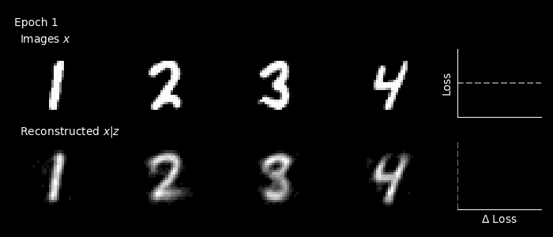

# autoencodersplz

A variety of autoencoder structured models for generative modeling and/or representation learning in pytorch.

## Table of contents

- [Models](#models)  
  - [LinearAE](#linearae)
  - [LinearResidualAE](#linearresidualae)
  - [ConvResidualAE](#convresidualae)
  - [VQVAE](#vqvae)
  - [FSQVAE](#fsqvae)
  - [MAE](#mae)  
- [Training](#training)
  - [Basic](#basic-training)
  - [Lightning](#lightning-training)
- [Examples](#examples)
  - [Basic usage](#examples-basic)

## <span id='models'> Models </span>

### <span id='linearae'> LinearAE </span>

A fully-connected autoencoder with a linear/multi-layer perceptron encoder and decoder

[Reducing the Dimensionality of Data with Neural Networks](https://www.science.org/doi/10.1126/science.1127647)

```python
import torch
from autoencodersplz.models import LinearAE

model = LinearAE(
    img_size = 224,
    in_chans = 3,
    hidden_layers = [64, 64],
    dropout_rate = 0,
    latent_dim = 16,
    beta = 0.1, # beta > 0 = variational
    max_temperature = 1000, # kld temperature annealing
    device = None
)

img = torch.rand(1, 3, 224, 224)

loss, reconstructed_img = model(img)
```

### <span id='linearresidualae'> LinearResidualAE </span>

A fully-connected autoencoder with a linear/multi-layer perceptron residual network encoder and decoder

[Skip Connections Eliminate Singularities](https://arxiv.org/abs/1701.09175)

```python
import torch
from autoencodersplz.models import LinearResidualAE

model = LinearResidualAE(
    img_size = 224,
    in_chans = 3,
    hidden_dim = [64, 64],
    blocks = [2, 2],
    dropout_rate = 0.1,
    with_batch_norm = False,
    latent_dim = 16,
    beta = 0.1, # beta > 0 = variational
    max_temperature = 1000, # kld temperature annealing
    device = None,
)

img = torch.rand(1, 3, 224, 224)

loss, reconstructed_img = model(img)
```

### <span id='convresidualae'> ConvResidualAE </span>

A convolutional autoencoder with a ResNet encoder and symmetric decoder

[Deep Residual Learning for Image Recognition](https://arxiv.org/abs/1512.03385)

```python
import torch
from autoencodersplz.models import ConvResidualAE

model = ConvResidualAE(
    img_size = 224,
    in_chans = 3,
    channels = [64, 128, 256, 512], 
    blocks = [2, 2, 2, 2], 
    latent_dim = 16,
    beta = 0, # beta > 0 = variational
    max_temperature = 1000, # kld temperature annealing
    upsample_mode = 'nearest', # interpolation method
    device = None,
)

img = torch.rand(1, 3, 224, 224)

loss, reconstructed_img = model(img)
```

### <span id='vqvae'> VQVAE </span>

A vector-quantized variational autoencoder with a ResNet encoder and symmetric decoder

[Neural Discrete Representation Learning](https://arxiv.org/abs/1711.00937)

```python
import torch
from autoencodersplz.models import VQVAE

model = VQVAE(
    img_size = 224,
    in_chans = 3,
    channels = [64, 128, 256, 512],
    blocks = [2, 2, 2, 2],
    codebook_size = 256,
    codebook_dim = 8,
    use_cosine_sim = True,
    kmeans_init = True,
    commitment_weight = 0.5,
    upsample_mode = 'nearest',
    vq_kwargs = {},
)

img = torch.rand(1, 3, 224, 224)

loss, reconstructed_img = model(img)
```

### <span id='fsqvae'> FSQVAE </span>

A finite-scalar quantized variational autoencoder with a ResNet encoder and symmetric decoder

[Finite Scalar Quantization: VQ-VAE Made Simple](https://arxiv.org/abs/2309.15505)

```python
import torch
from autoencodersplz.models import FSQVAE

model = FSQVAE(
    img_size = 224,
    in_chans = 3,
    channels = [64, 128, 256, 512],
    blocks = [2, 2, 2, 2],
    levels = [8, 6, 5],
    upsample_mode = 'nearest'
)

img = torch.rand(1, 3, 224, 224)

loss, reconstructed_img = model(img)
```

### <span id='mae'> MAE </span>

A masked autoencoder with a vision transformer encoder and decoder

[Masked Autoencoders Are Scalable Vision Learners](https://arxiv.org/abs/2111.06377)

```python
import torch
from autoencodersplz.models import MAE

model = MAE(
    img_size = 224,
    patch_size = 16,
    in_chans = 3,
    mask_ratio = 0.5,
    embed_dim = 768,
    depth = 12,
    num_heads = 12,
    mlp_ratio = 4,
    pre_norm = False,
    decoder_embed_dim = 768,
    decoder_depth = 12,
    decoder_num_heads = 12,
    norm_layer = nn.LayerNorm,
    patch_norm_layer = nn.LayerNorm,
    post_norm_layer = nn.LayerNorm,
    device = None,
)

img = torch.rand(1, 3, 224, 224)

loss, reconstructed_img = model(img)
```

## <span id='training'> Training </span>

### <span id='basic-training'> Basic </span>

The `Trainer` class enables basic training using a single CPU or GPU for any model in the `autoencodersplz` library. The `Trainer` class will also automatically save the autoencoder model, backbone/encoder, losses, and a visualization of the training process (`.gif`) if you provide a path to the `output_dir` argument.

```python
from autoencodersplz.trainers import Trainer

trainer = Trainer(
    autoencoder,
    train = train_dataloader,
    valid = valid_dataloader,
    epochs = 128,
    learning_rate = 5e-4,
    betas = (0.9, 0.95),
    weight_decay = 0.05,
    patience = 10,
    scheduler = 'plateau',
    save_backbone = True,
    show_plots = False,
    output_dir = 'training_run/',
    device = None,
)

trainer.fit()
```

By default, `Trainer` uses an `AdamW` optimizer and either a `CosineDecay` ('cosine') or `ReduceLROnPlateau` ('plateau') scheduler. If you want to use different optimizers or schedulers, just re-assign a new optimizer or scheduler to the `.optimizer` or `.scheduler` attributes (with `trainer.model.parameters()`) prior to calling `trainer.fit()`.

### <span id='lightning-training'> Lightning </span>

To make it easier to scale to multi-gpu/distributed training, all `autoencodersplz` models are configured for use with [pytorch lightning](https://lightning.ai/docs/pytorch). Each model is setup with a default optimizer and scheduler and can be directly called by the pytorch lightning trainer. See an example below.

```python
import lightning.pytorch as pl
from autoencodersplz.models import FSQVAE

model = FSQVAE(
    img_size = 28,
    in_chans = 1,
    channels = [8, 16],
    blocks = [1, 1],
    levels = [8],
    upsample_mode = 'nearest'
    learning_rate = 1e-3,
    factor = 0.1,
    patience = 30,
    min_lr = 1e-6
) 

trainer = pl.Trainer(gpus=4, max_epochs=256)

trainer.fit(model, train_dataloader, valid_dataloader)
```

## <span id='examples'> Examples </span>

### <span id='examples-basic'> Basic usage </span>

Here's a basic example of training a fully connected autoencoder on MNIST. The data is downloaded and loaded and then the autoencoder is fit. The training info is logged to the output directory (`training/`) and a GIF of the training routine is generated for visual inspection.



```python
from torch.utils.data import DataLoader
from torchvision.datasets import MNIST
from torchvision.transforms import ToTensor
from autoencodersplz.models import LinearAE
from autoencodersplz.trainers import Trainer

train_loader = DataLoader(
    MNIST(root='data/', train=True, download=True, transform=ToTensor()),
    batch_size = 32,
    shuffle = True,
)

test_loader = DataLoader(
    MNIST(root='data/', train=False, download=True, transform=ToTensor()),
    batch_size = 32,
    shuffle = False,
)

model = LinearAE(
    img_size = 28,
    in_chans = 1,
    hidden_layers = [256, 128],
    dropout_rate = 0,
    latent_dim = 32,
    beta = 0,
)

trainer = Trainer(
    model, 
    train_loader, 
    test_loader, 
    epochs = 32, 
    learning_rate = 1e-3, 
    output_dir = 'training/'
)
        
trainer.fit()
```